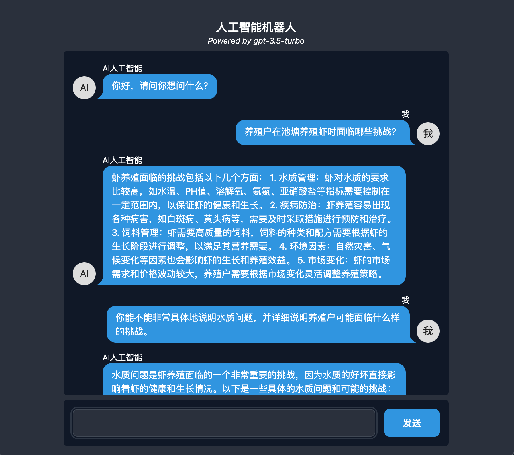
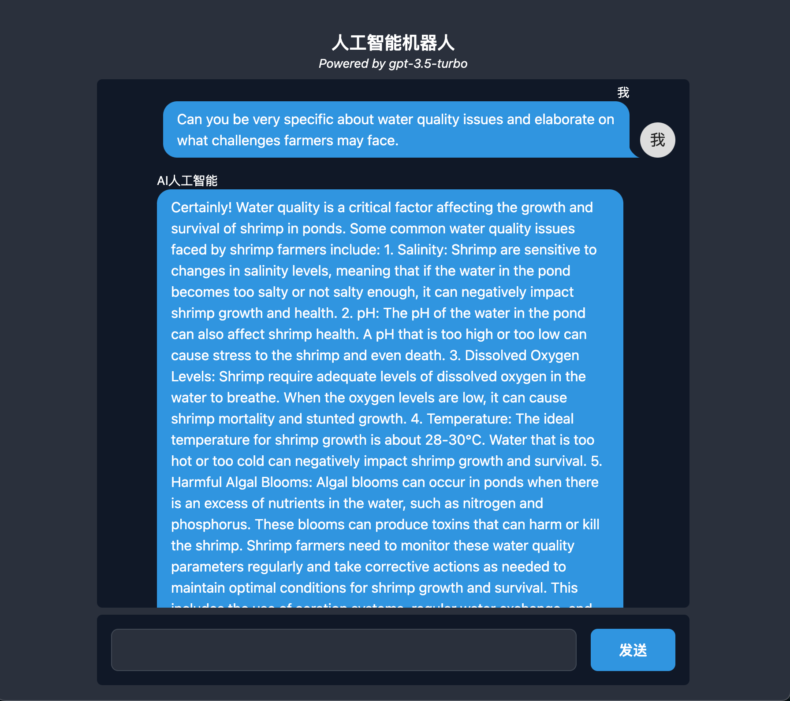

# GPT-Agricultural-Chat-Bot
The project is helping hundreds of rural Chinese farmers access agricultural knowledge with GPT-3.5, an initiative aimed at addressing the lack of access to up-to-date and accurate agricultural information by farmers in remote regions of China. Due to internet censorship policies in China, OpenAI's official website is inaccessible to Chinese users, and this has resulted in limited access to OpenAI's advanced artificial intelligence technologies in the country. 

The project utilizes OpenAI's powerful GPT-3.5 natural language processing capabilities to build a web chat app that allows farmers to ask any farming-related questions and receive reliable and relevant information in real-time. The app's user-friendly interface enables farmers with limited technology skills to access this information easily and quickly, without the need for complex software or internet navigation.

## Live Demo

```bash
  https://www.sheldon-gpt-bot.com/
```

## Screenshots



